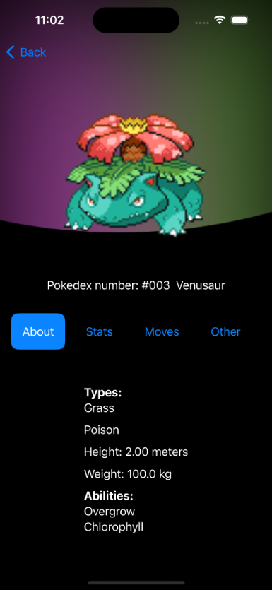

 

  

  <h3 align="center">iDex</h3>

  

    An Pokedex-like app that is built completely in SwiftUI
     
     
  

    

## About The Project

  

Features:

Comprehensive Pokédex: Explore all Pokémon up to Generation 8, complete with detailed movesets and "About" information.

Search: Find your favorite Pokémon in a flash with the intuitive search feature.

Shiny Sprites: Discover the rare and exciting shiny forms of Pokémon.

Clean UI: Navigate and explore the world of Pokémon with a beautifully designed SwiftUI interface.

## Built With

iDex leverages the following awesome packages:

PokeAPI: The foundation for accurate Pokémon data.
FluidGradient: For eye-catching gradient effects.
SDWebImage: Efficient image loading and caching.
WhatsNewKit: To showcase new updates to your users

* [PokeAPI](https://github.com/kinkofer/PokemonAPI)
* [FluidGradient](https://github.com/Cindori/FluidGradient)
* [SDWebImage](https://github.com/SDWebImage/SDWebImageSwiftUI)
* [WhatsNewKit](https://github.com/SvenTiigi/WhatsNewKit)

## Getting Started

### Prerequisites

Xcode 15
iOS 17

### Installation

Clone the repository: git clone https://github.com/Thetankty/iDex.git

Open the project in Xcode.

Build and run on your preferred simulator or device.

## Usage

Browse Pokémon: Scroll through the Pokédex or use the search bar to find specific Pokémon.

View Movesets: See the full list of moves a Pokémon can learn.

Discover Shiny Forms: Toggle to check out a Pokémon's shiny sprite.

## Roadmap

Even More Pokémon: Support for future Pokémon generations.

Expanded Sprites: Additional sprite variations.

Stats Tab: Display detailed Pokémon stats.

Team Builder: Create and save your dream Pokémon teams.

Extensive Information: Dive deeper with even more in-depth Pokémon data.

## Contributing

Contributions are what make the open source community such an amazing place to be learn, inspire, and create. Any contributions you make are **greatly appreciated**.
* If you have suggestions for adding or removing projects, feel free to [open an issue](https://github.com/thetankty/iDex/issues/new) to discuss it, or directly create a pull request after you edit the *README.md* file with necessary changes.
* Please make sure you check your spelling and grammar.
* Create individual PR for each suggestion.
* Please also read through the [Code Of Conduct](https://github.com/thetankty/iDex/blob/main/CODE_OF_CONDUCT.md) before posting your first idea as well.

### Creating A Pull Request

1. Fork the Project
2. Clone Your Fork (`git clone https://github.com/thetankty/iDex.git `)
3. Create a Branch: (`git checkout -b feature/my-awesome-changes`)
4. Make Your Changes:  Edit the code to implement your feature or fix.
5. Commit and Push 
(`git commit -m "Add a fantastic new feature"`
`git push origin feature/my-awesome-changes`)
6. Open a Pull Request:  Go to your forked repository on GitHub and click the "Compare & pull request" button.  Provide a clear title and description of your changes.

## License

Distributed under the MIT License. See [LICENSE](https://github.com/thetankty/iDex/blob/main/LICENSE.md) for more information.

## Authors

* **[Tyler Holgate](https://github.com/thetankty)** - *Student Developer* - [My Website](https://tylerholgate.co.uk) - *Built iDex*
